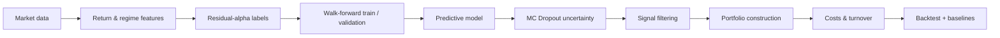

<div align="center">

# Regime Residual Portfolio

### Residual-alpha forecasting and monthly portfolio construction with leakage-aware walk-forward evaluation.


</div>

## Overview

This project explores whether **residual return signals** can be combined with market-regime features and uncertainty estimates to support monthly portfolio construction.

The emphasis is on building a **research-grade, reproducible evaluation pipeline** rather than presenting a backtest as guaranteed alpha. The workflow includes leakage-aware walk-forward training, validation embargoes, uncertainty filtering, transaction-cost awareness, and simple baselines for comparison.

## Research pipeline



## Key ideas

### Residual-alpha targets

The learning target is framed around residual performance rather than raw return prediction, with the goal of isolating asset-specific signal from broad market exposure.

### Regime conditioning

Trend, volatility, and drawdown features are used to give the model context about the surrounding market environment instead of treating every month as identically distributed.

### Walk-forward evaluation

Training and validation move forward through time. A validation embargo is included to reduce contamination between adjacent periods and make the evaluation closer to a real deployment setting.

### Uncertainty-aware filtering

MC Dropout is used at inference time to estimate predictive uncertainty. Signals can be filtered rather than blindly converting every model output into a trade.

### Cost-aware portfolio construction

The pipeline tracks turnover and transaction costs so that portfolio decisions are evaluated after implementation friction rather than on frictionless predictions alone.

### Baselines

Results are designed to be compared against simple alternatives such as:

- equal-weight allocation;
- momentum;
- ridge-based prediction.

## Repository structure

```text
.
├── configs/                # Experiment configuration
├── src/                    # Data, modeling, backtest and portfolio modules
├── tests/                  # Automated tests
├── docs/
│   └── PROJECT_REPORT.md   # Research framing and limitations
├── run.py                  # End-to-end entry point
├── requirements.txt
└── README.md
```

## Quickstart

```bash
python -m venv .venv
source .venv/bin/activate
pip install -r requirements.txt
python run.py --config configs/base.yaml
```

On Windows PowerShell:

```powershell
python -m venv .venv
.\.venv\Scripts\Activate.ps1
pip install -r requirements.txt
python run.py --config configs/base.yaml
```

## Generated outputs

A completed run can produce artifacts such as:

```text
results/
├── backtest_summary.json
├── equity_curve.csv
├── weights.csv
├── trades.csv
├── metrics.csv
└── plots/

models/
├── *.pt
└── *.pkl
```

Experiment tracking is supported through Weights & Biases, with an offline fallback.

## What this project demonstrates

Beyond the finance use case, this repository is mainly an exercise in **time-aware ML evaluation**:

- avoiding temporal leakage;
- separating modeling from portfolio decision logic;
- evaluating uncertainty instead of only point predictions;
- comparing against explicit baselines;
- accounting for turnover and costs;
- keeping experiments reproducible through configuration.

## Limitations

This is a research workflow, not investment advice and not evidence of guaranteed future returns. Results are sensitive to non-stationarity, transaction-cost assumptions, universe construction, data quality, and configuration choices.

See [`docs/PROJECT_REPORT.md`](./docs/PROJECT_REPORT.md) for the research framing and limitations.

---

<sub>Built as an applied ML research project at the intersection of forecasting, uncertainty estimation, and portfolio construction.</sub>
